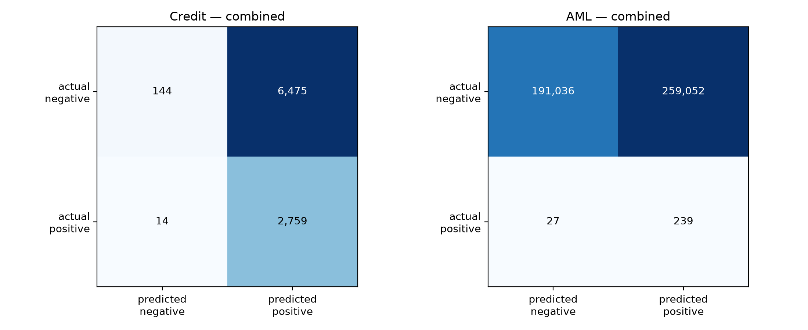
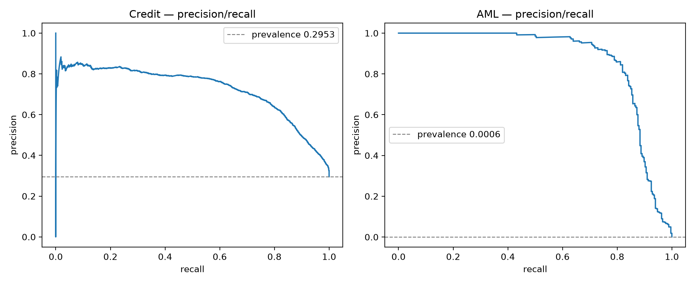
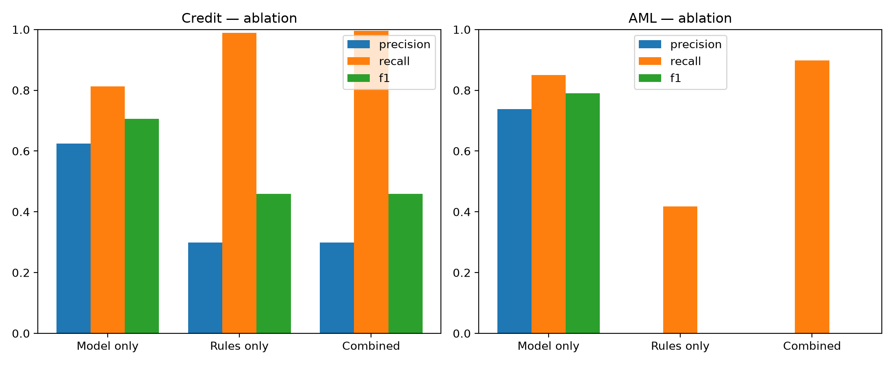

# FRAML — System Evaluation

Generated 2026-08-17 13:10 UTC on the `system` split.

Both the credit model and the AML model were fitted on the `train` partition. The `system` partition is split by customer, so no customer appearing below contributed a single row to training. Every figure here is out-of-sample.

## 1. Credit assessment

9,392 applications from 1,174 customers, scored against the dataset's `Credit_Score` label at a decision threshold of 0.28.

### Ablation

| Configuration | Precision | Recall | F1 | Accuracy | Flagged | TP | FP | FN |
|---|---|---|---|---|---|---|---|---|
| Model only | 0.625 | 0.8121 | 0.7064 | 0.8007 | 3603 | 2252 | 1351 | 521 |
| Rules only | 0.2989 | 0.9888 | 0.459 | 0.3118 | 9175 | 2742 | 6433 | 31 |
| Combined (agent) | 0.2988 | 0.995 | 0.4596 | 0.3091 | 9234 | 2759 | 6475 | 14 |

Model and rules disagree on **5,624 applications (59.9%)**, and those contain **518 of 2,773 true positives (18.7%)**. Those are the cases the agent routes to `Review` rather than deciding automatically.

### Decision distribution

| Decision | Applications |
|---|---|
| Review | 7142 |
| Decline | 2092 |
| Approve | 158 |

## 2. AML screening

450,354 transactions from 1,174 customers, prevalence 0.00059, threshold 0.9.

Accuracy is deliberately omitted: at this prevalence, predicting "never laundering" scores over 99.9% and detects nothing.

### Ablation

| Configuration | Precision | Recall | F1 | F2 | PR-AUC | Flagged | TP | FP | FN |
|---|---|---|---|---|---|---|---|---|---|
| Model only | 0.7386 | 0.8496 | 0.7902 | 0.8248 | 0.8693 | 306 | 226 | 80 | 40 |
| Rules only | 0.0007 | 0.4173 | 0.0014 | 0.0036 |  | 154620 | 111 | 154509 | 155 |
| Combined (agent) | 0.0009 | 0.8985 | 0.0018 | 0.0046 | 0.8693 | 259291 | 239 | 259052 | 27 |

Alert volume at the combined decision: **1424.7 per day** across this population.

### Recall by laundering typology

STRUCTURING and FAN_* are reachable from amount and velocity features. SCATTER_GATHER and CYCLE exist only in the transaction graph, so weak recall there would indicate the multi-hop features are not contributing.

| Typology | Positives | Recall |
|---|---|---|
| CYCLE | 12 | 1.0 |
| FAN_IN | 120 | 0.95 |
| FAN_OUT | 52 | 0.9423 |
| SCATTER_GATHER | 24 | 0.25 |
| STRUCTURING | 58 | 1.0 |

### Action distribution

| Recommended action | Transactions |
|---|---|
| No action | 191063 |
| Escalate for analyst review | 154559 |
| Enhanced monitoring | 104613 |
| File SAR — recommend review | 119 |

## 3. KYC

KYC is a deterministic database lookup, so it is verified exhaustively rather than sampled: all 1,174 `system` customers plus 200 identifiers known not to exist.

- Known customers classified Existing: **1,174 / 1,174**
- Unknown identifiers classified New: **200 / 200**
- Accuracy: **1.0000**

## 4. Policy rule coverage

How often each deterministic rule fired. A rule that never fires across the whole split is either mis-specified or redundant.

| Credit rule | Applications |
|---|---|
| DELINQ-COUNT | 8682 |
| UTIL-30-GUIDANCE | 5979 |
| MINPAY-ONLY | 4969 |
| INQUIRY-6 | 3871 |
| LOAN-COUNT | 2088 |
| DELINQ-30-REPORTABLE | 1909 |
| MIX-BAD | 1760 |
| THIN-FILE | 136 |
| DTI-36-MANUAL | 37 |
| DTI-45-CEILING | 37 |

| AML rule | Transactions |
|---|---|
| MULE-FAN-IN | 167307 |
| SAR-5K | 154620 |
| STRUCTURING | 19209 |
| RAPID-PASSTHROUGH | 13991 |
| CTR-10K | 9018 |
| VELOCITY-SPIKE | 7375 |
| FUNNEL-ACCOUNT | 448 |
| LAYERING-CYCLE | 263 |

## 5. Throughput

| Component | Items | Seconds | Items/sec |
|---|---|---|---|
| Credit | 9392 | 0.46 | 20448.5 |
| AML | 450354 | 35.44 | 12707.3 |
| KYC | 1374 | 68.43 | 20.1 |

## Figures

## Caveats

- The AML labels are typologies injected by our own generator (`EDA/new_trans.ipynb`). These figures demonstrate that the pipeline detects the patterns it was built to detect; they are not evidence of real-world detection performance, and the threshold would need recalibrating against true prevalence before any operational use.
- Laundering prevalence was set at 3% of customers to make the problem trainable. That is far above any real portfolio, so precision in particular will not transfer.
- The credit labels come from the source dataset and are used as provided.
