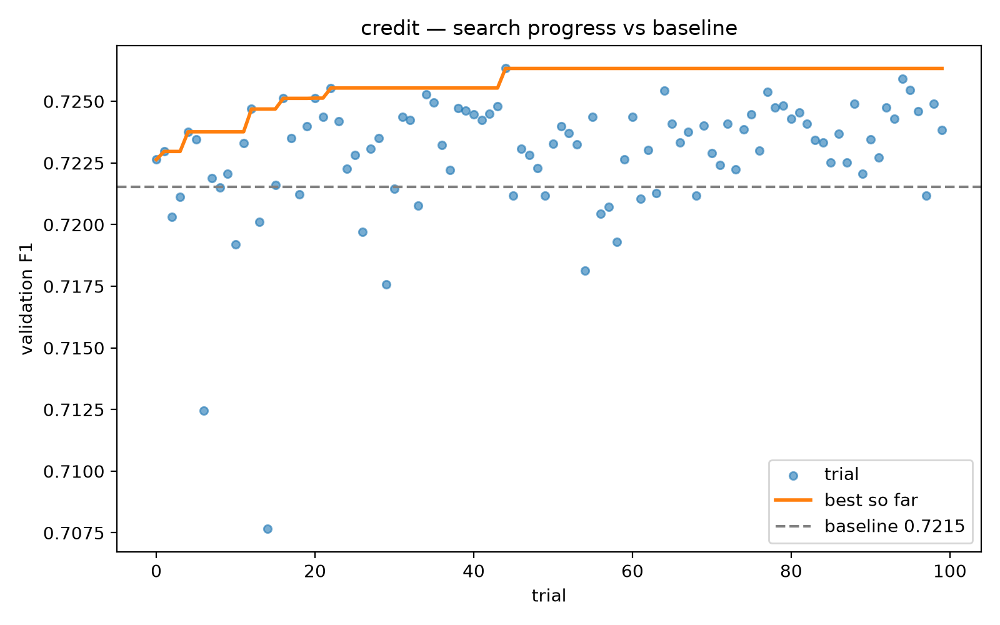
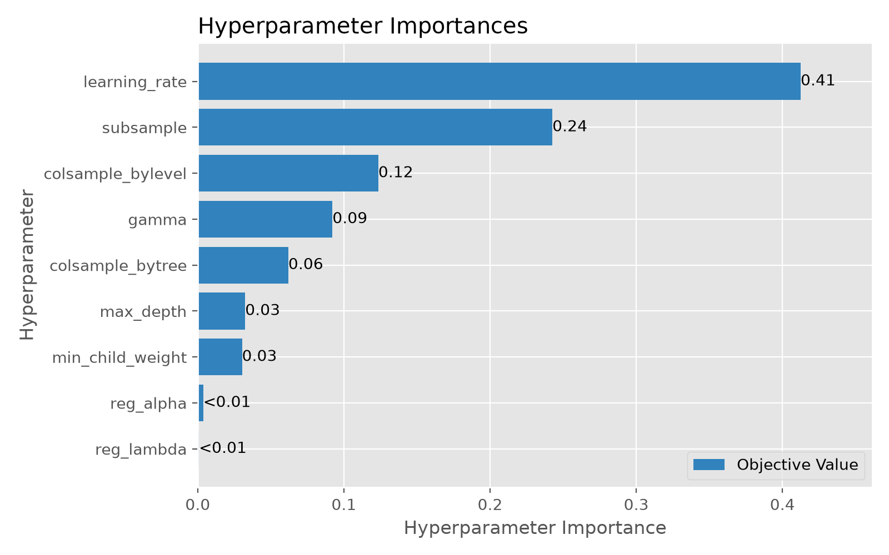
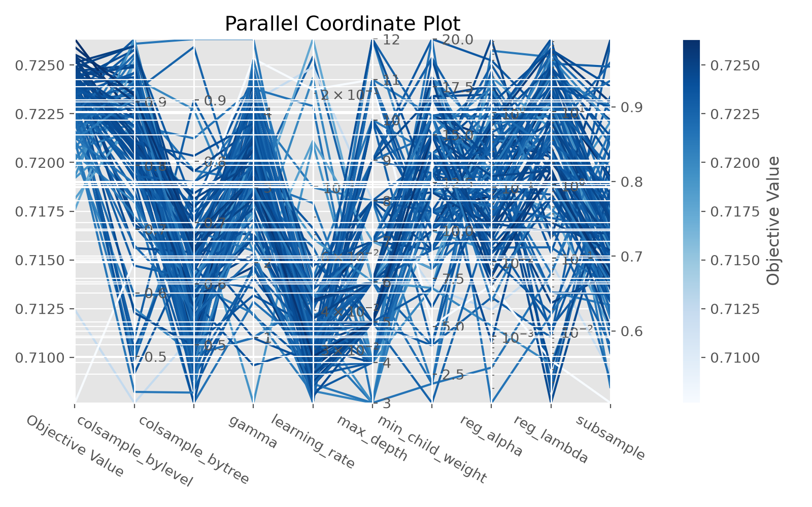
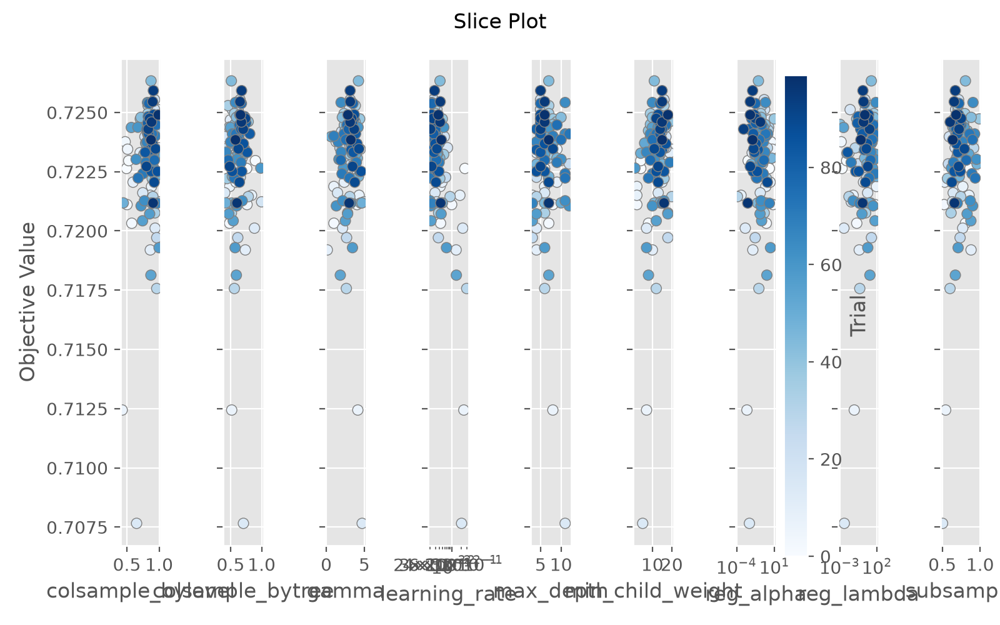
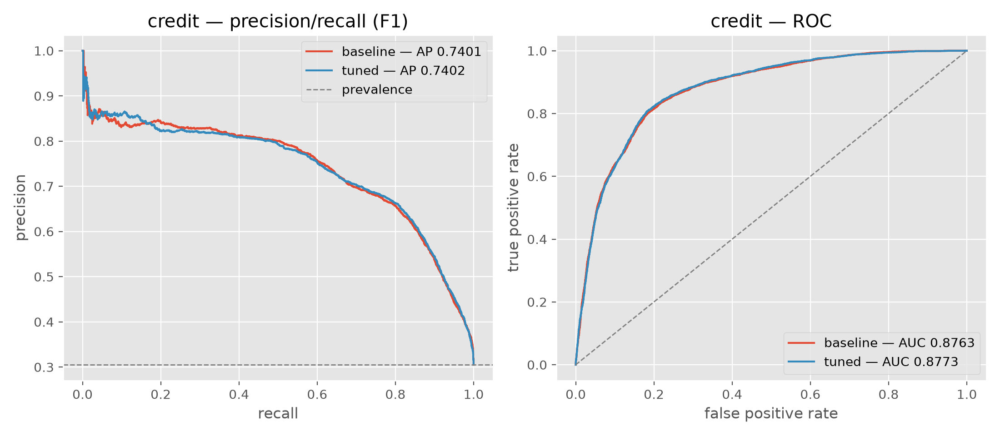

# Hyperparameter Tuning

Generated 2026-08-15 19:18 UTC.

Search uses Optuna's TPE sampler over a deliberately wide space. An exhaustive grid is not attainable over continuous hyperparameters — ten points on each of four continuous dimensions, crossed with the discrete ones, is over a million fits — so the honest description is a wide guided search, not an exhaustive one. The discrete ranges (`max_depth` 3–12, `min_child_weight` 1–20) do cover every sensible value.

The tuned model is promoted only if it beats the baseline on validation. Where it does not, the baseline remains the production artifact and the table below records that.

## CREDIT

- Objective: **validation F1 at best threshold**
- Trials completed: **30**
- Outcome: **tuned model promoted**

| Metric | Baseline | Tuned |
|---|---|---|
| val_f1 | 0.7215 | 0.7255 |
| val_roc_auc | 0.8763 | 0.8777 |
| threshold | 0.2900 | 0.3000 |

### Best parameters

```json
{
  "n_estimators": 1500,
  "early_stopping_rounds": 40,
  "eval_metric": "logloss",
  "random_state": 42,
  "max_depth": 5,
  "learning_rate": 0.026110276791275963,
  "subsample": 0.7152260414518055,
  "colsample_bytree": 0.6520991580104895,
  "colsample_bylevel": 0.9295130197954636,
  "min_child_weight": 16,
  "reg_lambda": 2.389368360808951,
  "reg_alpha": 0.4452610770837888,
  "gamma": 3.1461969424938987
}
```

### Figures






